# 🏛 Octopus AI Ecosystem Architecture Specification

This document details the architectural topology, communication protocols, state synchronization models, and execution DAGs interconnecting **OctopusStudio**, **octocut**, **octolimb**, and **OctopusMCP-Manager**.

---

## 1. Top-Level Architectural Topology

The ecosystem is partitioned into four decoupled layers communicating over deterministic interfaces:

```
+-------------------------------------------------------------------------------+
|                       ORCHESTRATION & REASONING LAYER                        |
|                                OctopusStudio                                  |
|   - Task Planner (DAG Scheduler)         - Sub-Agent Execution Pool           |
|   - Real-Time Virtual DOM Sandbox        - State & Context Bus (TanStack)     |
+-------------------------------------------------------------------------------+
       |                                |                             |
       | JSON-RPC 2.0 (MCP Protocol)    | gRPC / WebSocket Event Bus  | Media Job Queue / IPC
       v                                v                             v
+-----------------------------+ +-----------------------------+ +-----------------------------+
|    TOOLING & DATA LAYER     | |    COMPUTER ACTUATION       | |      MEDIA & SYNTHESIS      |
|     OctopusMCP-Manager      | |          octolimb           | |           octocut           |
|  - MCP Server Registry      | |  - OS Event Injector        | |  - FFmpeg & Wasm Pipeline   |
|  - Security & Policy Filter | |  - Vision & OCR Parser      | |  - Kinetic Subtitle Sync    |
|  - SSE / stdio / gRPC Bridge| |  - Native Mouse/Key Actuator| |  - Multi-Track Timeline Mix |
|  - Auth & Credential Vault  | |  - Browser Sandbox Context  | |  - Audio Ducking & Mastering|
+-----------------------------+ +-----------------------------+ +-----------------------------+
```

---

## 2. Cross-Tool Communication Protocols

| Link | Communication Protocol | Payload Format | Latency Target | Failure Strategy |
| :--- | :--- | :--- | :--- | :--- |
| **OctopusStudio ↔ OctopusMCP-Manager** | JSON-RPC 2.0 over `stdio` / SSE | MCP v1.0 Schema | < 15ms | Automatic reconnect & exponential backoff |
| **OctopusStudio ↔ octolimb** | gRPC / Typed WebSocket | Protocol Buffers / JSON | < 25ms | Action replay with screen-diff validation |
| **OctopusStudio ↔ octocut** | Distributed Job Queue (Redis/IPC) | Job Manifest JSON + Shared Volume | Async / Streamed | Checkpointed multi-pass render fallback |
| **octolimb ↔ octocut** | Shared Frame Buffer / Ring Buffer | RAW NV12 / MP4 Chunks | Near Zero-Copy | Frame-drop resilience |

---

## 3. The 4 Core Tool Responsibilities & Contract

### 3.1 OctopusStudio (The Central Brain)
- **Role:** Decomposition of macro-level prompts into actionable DAGs.
- **Agent Roles:**
  - `Architect`: Produces system designs, data contracts, and dependency graphs.
  - `Executor`: Generates code, modifies local files, and issues build instructions.
  - `Explorer`: Read-only code inspection, semantic symbol discovery, log aggregation.
  - `Tester`: Dispatches test runs to `octolimb` and validates assertions.
  - `Verifier`: Runs type-checks, linters, and validates visual regression artifacts from `octocut`.

### 3.2 OctopusMCP-Manager (The Tool Gateway)
- **Role:** Standardized Model Context Protocol hub.
- **Dynamic Capabilities:**
  - Exposes tools from remote APIs (Stripe, GitHub, Jira, AWS) and local datastores (SQLite, PostgreSQL, Local FS).
  - Enforces least-privilege security policies, preventing unauthorized sub-agent actions.
  - Monitors tool health, token usage per tool call, and auto-spawns dead MCP servers.

### 3.3 octolimb (The Actuation & Vision Layer)
- **Role:** Human-like interaction with desktop, terminal, and browser environments.
- **Execution Pipeline:**
  1. **Capture:** High-framerate desktop/window snapshot.
  2. **Perception:** Vision model + OCR identifies interactive elements and coordinates.
  3. **Actuation:** Dispatches hardware-level mouse clicks, keystrokes, or scrolling.
  4. **Verification:** Inspects delta screen diff to confirm action succeeded before yielding back to Studio.

### 3.4 octocut (The Multimodal Media Synthesizer)
- **Role:** Programmatic audio/video transformation and rendering.
- **Capabilities:**
  - Automated silence stripping and audio-frequency threshold filtering.
  - Smart viewport cropping (converting 16:9 recordings to 9:16 vertical shorts).
  - Multilingual transcription and kinetic subtitle generation.
  - Programmatic overlay insertion (watermarks, CTA cards, progress bars, audio visualizers).

---

## 4. End-to-End Orchestration Lifecycle

```mermaid
sequenceDiagram
    autonumber
    participant Client as User Prompt / Webhook
    participant Studio as OctopusStudio
    participant MCP as OctopusMCP-Manager
    participant Limb as octolimb
    participant Cut as octocut

    Client->>Studio: "Test new feature, generate demo clip, and deploy"
    
    rect rgb(30, 41, 59)
        note over Studio, MCP: Phase 1: Planning & Tool Resolution
        Studio->>MCP: Discover available tools for environment & GitHub
        MCP-->>Studio: Return tools list (Git, Browser, Database)
        Studio->>Studio: Generate Multi-Agent DAG Plan
    end

    rect rgb(15, 23, 42)
        note over Studio, Limb: Phase 2: Actuation & Verification
        Studio->>Limb: Dispatch browser test scenario with screen recording
        Limb->>Limb: Perform clicks, assert DOM state, capture video buffer
        Limb-->>Studio: Send test logs (Pass) & raw video path
    end

    rect rgb(30, 41, 59)
        note over Studio, Cut: Phase 3: Media Processing
        Studio->>Cut: Dispatch media job (add kinetic captions, strip idle frames, add intro)
        Cut->>Cut: Render high-fidelity 4K clip (`showcase.mp4`)
        Cut-->>Studio: Return render status & artifact URL
    end

    rect rgb(15, 23, 42)
        note over Studio, MCP: Phase 4: Delivery & Publishing
        Studio->>MCP: Call GitHub MCP to commit code & attach `showcase.mp4`
        Studio->>MCP: Call Slack MCP to notify engineering team
        MCP-->>Studio: Actions verified
    end

    Studio-->>Client: Pipeline complete with full report & deliverables
```



---

## 5. Security & Isolation Model

1. **Sandboxed Sub-Agent Scopes:** Sub-agents in `OctopusStudio` have strictly delineated file access and allowed tool lists.
2. **MCP Boundary Defense:** `OctopusMCP-Manager` isolates external credentials in a local encrypted vault, exposing only tokenized action handlers to the LLMs.
3. **Computer-Use Safeguards:** `octolimb` operates with configurable screen bounding boxes, kill-switch hotkeys, and prompt injection guards to avoid unauthorized desktop operations.
4. **Clean Media Workspace:** `octocut` processes temporary assets in isolated disk partitions with automated garbage collection upon completion.
