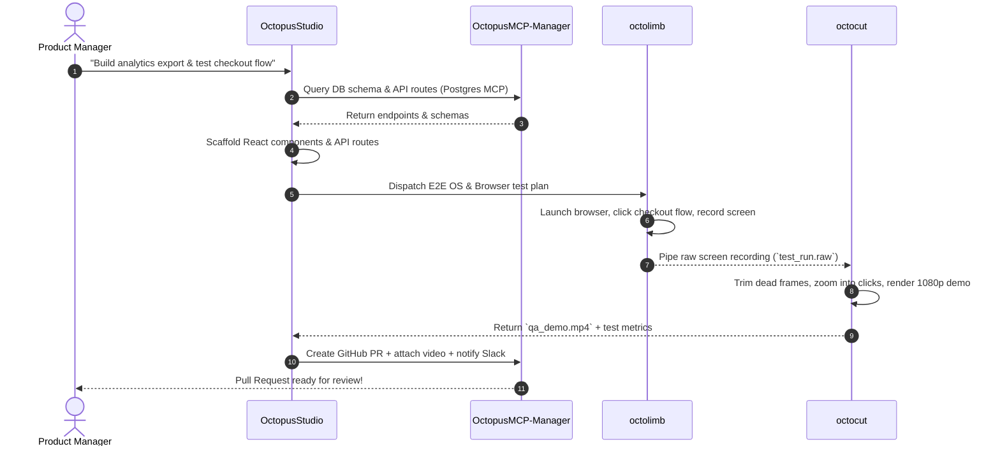

# 🐙 Octopus AI Ecosystem

<div align="center">

[](https://opensource.org/licenses/MIT)
[](#architecture)
[](https://github.com/kaleemibnanwar/OctopusMCP-Manager)
[](#interconnection--automation-blueprints)
[](#)

**The unified autonomous intelligence framework: orchestrating multi-agent IDEs, programmatic media pipelines, OS-level computer use, and dynamic Model Context Protocol (MCP) tooling.**

[Ecosystem Overview](#-ecosystem-pillars) • [Tool Breakdown](#-deep-dive-the-4-core-tools) • [Interconnection & Automation](#-interconnection--automation-blueprints) • [Architecture](#-system-architecture) • [Quickstart](#-quickstart) • [Recipes](#-automation-systems-in-action)

</div>

---

## 🌟 Ecosystem Vision

Modern artificial intelligence requires moving beyond isolated chat interfaces. Real-world autonomy requires four complementary capabilities:
1. **The Brain & Studio (`OctopusStudio`):** Visual workspace, code generation, reasoning engines, and hierarchical sub-agent DAG orchestration.
2. **The Voice & Vision Media Engine (`octocut`):** High-throughput video, audio, transcription, and multimodal content processing.
3. **The Physical & Digital Hands (`octolimb`):** OS-level computer use, GUI automation, native window control, mouse/keyboard actuation, and headless browser navigation.
4. **The Central Nervous System & Tool Router (`OctopusMCP-Manager`):** Dynamic Model Context Protocol (MCP) server discovery, sandboxing, permission brokering, and tool routing.

By interconnecting these four specialized systems, the **Octopus AI Ecosystem** enables end-to-end autonomous loops: from ideation and code generation to live software testing, programmatic multimedia production, and autonomous cross-platform enterprise automation.

---

## 🧩 Ecosystem Pillars

```
                     ┌─────────────────────────────────────────┐
                     │              OctopusStudio              │
                     │  (Orchestrator • AI IDE • Agent DAG)    │
                     └────────────────────┬────────────────────┘
                                          │
                  ┌───────────────────────┼───────────────────────┐
                  ▼                       ▼                       ▼
      ┌──────────────────────┐ ┌──────────────────────┐ ┌──────────────────────┐
      │  OctopusMCP-Manager  │ │       octolimb       │ │       octocut        │
      │   (Tooling, APIs,    │ │   (Computer-Use, OS, │ │ (Video, Audio, Clip  │
      │    Cloud Connectors) │ │    Desktop & Browser)│ │  Synthesis & Media)  │
      └──────────────────────┘ └──────────────────────┘ └──────────────────────┘
                  │                       │                       │
                  └───────────────────────┼───────────────────────┘
                                          ▼
                      ┌─────────────────────────────────────────┐
                      │    Fully Autonomous Production Loop     │
                      │ (DevOps • Media Agency • RPA • QA Bot)  │
                      └─────────────────────────────────────────┘
```

| Component Repository | Primary Role | Key Superpowers | Core Technologies |
| :--- | :--- | :--- | :--- |
| **[OctopusStudio](https://github.com/kaleemibnanwar/OctopusStudio)** | Agentic IDE & Studio Hub | DAG-based task orchestration, live hot-reloading code sandbox, sub-agent lifecycle management, full-stack scaffolding | React, TypeScript, Vite, Tailwind CSS, TanStack Query |
| **[octocut](https://github.com/kaleemibnanwar/octocut)** | Intelligent Media Processor | AI video cutting, automated reel creation, silence stripping, timeline rendering, subtitle synthesis, audio master | Node.js, FFmpeg, Whisper AI, Canvas/Wasm, WebAudio |
| **[octolimb](https://github.com/kaleemibnanwar/octolimb)** | OS & GUI Computer-Use Agent | Native mouse/keyboard control, screen OCR & vision parsing, cross-platform OS scripting, headless browser automation | Python, Rust, NutJS/RobotJS, Playwright, Computer-Vision |
| **[OctopusMCP-Manager](https://github.com/kaleemibnanwar/OctopusMCP-Manager)** | MCP Protocol & Tool Hub | Dynamic MCP server registry, sandboxed execution, permission gateway, stdio/SSE/gRPC routing, health monitoring | TypeScript, MCP SDK, Docker, JSON-RPC 2.0, Zod |

---

## 🔍 Deep Dive: The 4 Core Tools

### 1. 🐙 [OctopusStudio](https://github.com/kaleemibnanwar/OctopusStudio)
**The Intelligent Agentic IDE & Orchestration Cockpit**

OctopusStudio serves as the command center for the entire ecosystem. It provides a modern browser-based IDE and workflow builder with live previews, allowing human developers and autonomous AI agents to collaborate seamlessly.

- **Hierarchical Agent Graph (DAG):** Decomposes complex human intents into sub-tasks distributed across specialized agents (*Architect*, *Executor*, *Explorer*, *Verifier*, *Reviewer*).
- **Interactive Live Workspace:** Hot-reloads code, renders full-stack web applications in an iframe sandbox, and performs type-checking and automated lint validation.
- **Unified Extension Engine:** Native hooks for dispatching jobs to `octocut`, commanding `octolimb` for testing, and fetching tool schemas from `OctopusMCP-Manager`.

```typescript
// Sample DAG task definition in OctopusStudio
await studio.dispatchTaskGraph({
  goal: "Build, verify, record, and publish marketing video for new Dashboard feature",
  subtasks: [
    { id: "code-gen", role: "executor", goal: "Implement analytics chart component" },
    { id: "e2e-test", role: "tester", dependsOn: ["code-gen"], goal: "Trigger octolimb to run visual browser tests" },
    { id: "media-gen", role: "executor", dependsOn: ["e2e-test"], goal: "Trigger octocut to generate 4K demo reel" },
    { id: "publish", role: "executor", dependsOn: ["media-gen"], goal: "Use OctopusMCP-Manager GitHub & Twitter tools to release" }
  ]
});
```

---

### 2. 🎬 [octocut](https://github.com/kaleemibnanwar/octocut)
**The Automated Multimodal Media & Video Processing Engine**

`octocut` is designed for high-velocity programmatic media operations. It bridges generative AI assets, raw recordings, screen captures, and voiceovers into broadcast-ready videos, shorts, tutorials, and promotional clips.

- **Intelligent Scene Splicing:** Identifies key moments, speech pauses, audio peaks, and transitions using acoustic and vision embeddings.
- **Automated Captioning & Motion Graphics:** Automatically transcribes speech, generates dynamic animated subtitles, applies lower-thirds, and overlays branding.
- **Multitrack Timeline Assembly:** Programmatically manages audio ducking, sound effects, B-roll insertion, and multi-format exports (16:9 4K YouTube, 9:16 Shorts/TikTok/Reels).

```javascript
import { OctoCutPipeline } from 'octocut';

const pipeline = new OctoCutPipeline({ resolution: '1080p', fps: 60 });
await pipeline
  .addScreenCapture('recording_artifacts/test_run.mp4')
  .stripSilences({ thresholdDb: -35, minDurationMs: 400 })
  .overlayVoiceover('audio/ai_narration.mp3', { autoDuck: true, duckLevel: -14 })
  .generateSubtitles({ font: 'Inter-Bold', animation: 'kinetic-pop' })
  .exportTo('dist/showcase_reel.mp4');
```

---

### 3. 🦾 [octolimb](https://github.com/kaleemibnanwar/octolimb)
**The Autonomous OS-Level Computer-Use & Actuation Layer**

Where APIs end, `octolimb` takes over. Giving the ecosystem "eyes and hands", `octolimb` allows AI agents to interact with any native desktop software, legacy enterprise GUI, terminal, or browser as a human would.

- **Vision-Guided UI Navigation:** Real-time screen capture, element bounding box detection, OCR parsing, and visual diff analysis.
- **Native OS Actuation:** Microsecond-precision mouse movements, multi-key combinations, drag-and-drop actions, clipboard management, and file system operations across Windows, macOS, and Linux.
- **Headless & Headed Browser Automation:** Deep integration with Chromium/WebKit for interacting with web apps that lack public APIs.

```python
from octolimb import ComputerAgent, ActionTarget

agent = ComputerAgent(vision_model="claude-3-5-sonnet")
# Autonomous OS interaction
agent.launch_app("Figma")
agent.click(ActionTarget.visual_prompt("Export Assets button"))
agent.press_hotkey(["ctrl", "shift", "e"])
agent.wait_for_file_download("/tmp/exports/bundle.zip")
```

---

### 4. 🌐 [OctopusMCP-Manager](https://github.com/kaleemibnanwar/OctopusMCP-Manager)
**The Model Context Protocol Registry, Gateway & Sandbox**

`OctopusMCP-Manager` is the universal connector. It implements the Anthropic Model Context Protocol (MCP) to supply every agent in the ecosystem with secure, dynamic, and versioned access to data sources, tools, APIs, and cloud services.

- **Dynamic Server Registry:** Hot-plug any standard MCP server (PostgreSQL, GitHub, Slack, AWS, FileSystem, Brave Search, Supabase, Jira, Docker).
- **Policy & Security Sandbox:** Role-based permission controls, rate-limiting, credential vaulting, and fine-grained token budgeting.
- **Protocol Multiplexing:** Exposes standard JSON-RPC 2.0 over `stdio`, Server-Sent Events (SSE), and gRPC tunnels for distributed multi-machine deployments.

```json
{
  "mcpServers": {
    "github": {
      "command": "npx",
      "args": ["-y", "@modelcontextprotocol/server-github"],
      "env": { "GITHUB_PERSONAL_ACCESS_TOKEN": "vault://github_token" }
    },
    "postgres": {
      "command": "npx",
      "args": ["-y", "@modelcontextprotocol/server-postgres", "postgresql://localhost/prod_db"]
    },
    "octolimb-bridge": {
      "command": "octolimb-mcp-server",
      "args": ["--port", "8900"]
    }
  }
}
```

---

## ⚡ Interconnection & Automation Blueprints

When these four tools collaborate, they form complex automated systems capable of autonomous execution without human intervention. Below are key systems enabled by this interconnection:

### Blueprint A: Autonomous Software Production & QA Pipeline
*Goal: Write feature code, run full visual regression testing on desktop & mobile viewports, compile demo videos, and submit a pull request with media assets.*



---

### Blueprint B: Autonomous AI Media & Content Generation Agency
*Goal: Convert documentation, GitHub release notes, or trending news into viral social media shorts, narrated video reels, and published posts.*

```mermaid
flowchart LR
    A[OctopusMCP-Manager<br/>Monitors GitHub/RSS/DB] -->|Trigger New Event| B[OctopusStudio<br/>Orchestration Engine]
    B -->|Generate Script & Prompts| C[OctopusStudio Sub-Agents]
    C -->|Synthesize Voice & Assets| D[octocut Multimodal Engine]
    C -->|Simulate App UI Actions| E[octolimb Computer-Use]
    E -->|High-FPS Capture| D
    D -->|Export Final Reels/Shorts| F[octocut Output]
    F -->|Upload via Web/API| G[octolimb Browser Uploader<br/>& MCP Social Connectors]
    G -->|Publish| H[YouTube / TikTok / X / LinkedIn]
```



---

### Blueprint C: Enterprise Legacy RPA & Desktop Intelligence Bridge
*Goal: Bridge modern LLMs with legacy Windows/Desktop applications (SAP GUI, AS400 terminal, offline accounting software) without native APIs.*

1. **OctopusMCP-Manager** receives incoming invoice PDFs from webhook or email connector.
2. **OctopusStudio** parses structured line-items and constructs an execution sequence.
3. **octolimb** launches the legacy ERP desktop application, navigates forms via vision coordinates, pastes invoice records, and verifies confirmation dialogs.
4. **octocut** compiles an audit trail video recording of the robotic execution for compliance review.
5. **OctopusMCP-Manager** posts confirmation back to PostgreSQL and updates accounting tables.

---

### Blueprint D: Self-Healing Code & Continuous Documentation Engine
*Goal: Continuously monitor production error logs, reproduce bugs locally via computer use, draft patches, and update docs.*

- **Trigger:** Sentry / CloudWatch MCP alerts `OctopusMCP-Manager`.
- **Diagnosis:** `OctopusStudio` reads stack trace, scans codebase, and generates reproduction script.
- **Reproduction:** `octolimb` executes reproduction steps in a live browser sandbox to confirm the bug.
- **Resolution:** `OctopusStudio` applies surgical code patch and verifies hot reload.
- **Verification:** `octolimb` re-runs the reproduction flow to verify resolution.
- **Documentation:** `octocut` generates an interactive visual changelog video for engineering teams.

---

## 🏗 System Architecture

```
                                  OCTOPUS AI ECOSYSTEM
 ┌──────────────────────────────────────────────────────────────────────────────────────┐
 │                                                                                      │
 │  ┌────────────────────────────────────────────────────────────────────────────────┐  │
 │  │                              OctopusStudio (IDE)                               │  │
 │  │   ┌───────────────┐   ┌────────────────┐   ┌───────────────┐   ┌────────────┐  │  │
 │  │   │ Task DAG Plan │   │ Sub-Agent Pool │   │ Live Preview  │   │ State Store│  │  │
 │  │   └───────┬───────┘   └───────┬────────┘   └───────┬───────┘   └─────┬──────┘  │  │
 │  └───────────┼───────────────────┼────────────────────┼─────────────────┼─────────┘  │
 │              │                   │                    │                 │            │
 │              ▼                   ▼                    ▼                 ▼            │
 │  ┌───────────────────────┐  ┌───────────────────────┐  ┌──────────────────────────┐  │
 │  │  OctopusMCP-Manager   │  │       octolimb        │  │         octocut          │  │
 │  │                       │  │                       │  │                          │  │
 │  │ • Server Registry     │  │ • Computer Use Engine │  │ • FFmpeg / WebCodecs     │  │
 │  │ • JSON-RPC / SSE Hub  │  │ • Mouse/Key Actuator  │  │ • Silence Stripper       │  │
 │  │ • Access Control      │  │ • Vision OCR & Diffs  │  │ • Subtitle / Audio Sync  │  │
 │  │ • Tool Sandboxes      │  │ • Browser Automator   │  │ • Motion Graphics Engine │  │
 │  └───────────┬───────────┘  └───────────┬───────────┘  └────────────┬─────────────┘  │
 │              │                          │                           │                │
 └──────────────┼──────────────────────────┼───────────────────────────┼────────────────┘
                ▼                          ▼                           ▼
      ┌──────────────────┐       ┌──────────────────┐       ┌──────────────────────┐
      │ External APIs &  │       │ Operating System │       │ Multimedia Content   │
      │ Cloud Datastores │       │ & Desktop Apps   │       │ & Social Platforms   │
      └──────────────────┘       └──────────────────┘       └──────────────────────┘
```

---

## 🚀 Quickstart

### 1. Clone Ecosystem Repositories
```bash
# Clone the complete Octopus suite
git clone https://github.com/kaleemibnanwar/OctopusStudio.git
git clone https://github.com/kaleemibnanwar/octocut.git
git clone https://github.com/kaleemibnanwar/octolimb.git
git clone https://github.com/kaleemibnanwar/OctopusMCP-Manager.git
```

### 2. Workspace Unified Setup
```bash
# Setup pnpm monorepo workspace
pnpm install

# Start OctopusMCP-Manager Gateway
cd OctopusMCP-Manager && pnpm start &

# Launch OctopusStudio Agentic IDE
cd ../OctopusStudio && pnpm dev
```

### 3. Register Tool Bridges
Add the following configuration into your `octopus.config.json`:

```json
{
  "$schema": "https://octopus.dev/schemas/config.v1.json",
  "name": "Octopus-Automation-Cluster",
  "nodes": {
    "studio": { "port": 5173, "agents": ["architect", "executor", "tester"] },
    "mcp": { "port": 3000, "registry": "./mcp-servers.json" },
    "octolimb": { "rpc": "localhost:8900", "display": ":99", "visionModel": "claude-3-5-sonnet" },
    "octocut": { "tempDir": "./.octopus/media", "hardwareAcceleration": "auto" }
  }
}
```

---

## 📖 Ecosystem Documentation Index

Explore in-depth architecture, integration patterns, and production blueprints:

- 🏛 **[ARCHITECTURE.md](./ARCHITECTURE.md)**: Deep dive into the interconnection protocols, DAG schedulers, RPC bridges, and memory synchronization.
- 🧪 **[AUTOMATION_RECIPES.md](./AUTOMATION_RECIPES.md)**: Ready-to-use production recipes for DevOps, RPA, Video Marketing, and QA testing.
- 🔌 **[INTEGRATION_GUIDE.md](./INTEGRATION_GUIDE.md)**: SDK references, JSON-RPC schemas, event subscriptions, and custom tool developer guide.

---

## 🤝 Contributing

We welcome contributions across all four repositories!
1. Fork any of the target repositories (`OctopusStudio`, `octocut`, `octolimb`, `OctopusMCP-Manager`).
2. Create a feature branch: `git checkout -b feature/amazing-agent-capability`.
3. Commit your changes: `git commit -m 'feat: add automated timeline trimming to octocut'`.
4. Push to branch: `git push origin feature/amazing-agent-capability`.
5. Open a Pull Request!

---

## 📄 License

Distributed under the MIT License. See `LICENSE` for more information.

<div align="center">
Built with 🐙 by <a href="https://github.com/kaleemibnanwar">Kaleem Ibn Anwar</a> and the Octopus AI Community.
</div>
